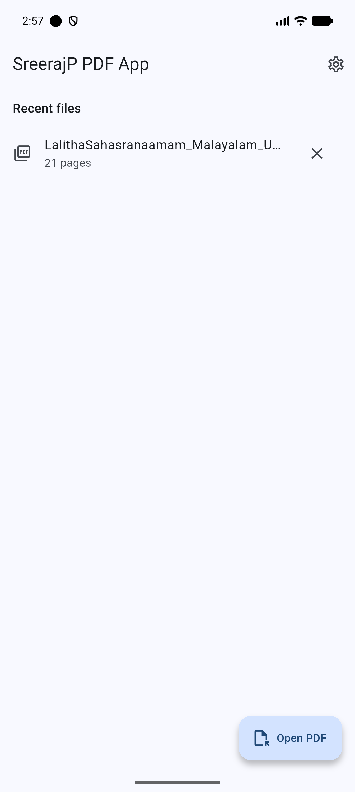
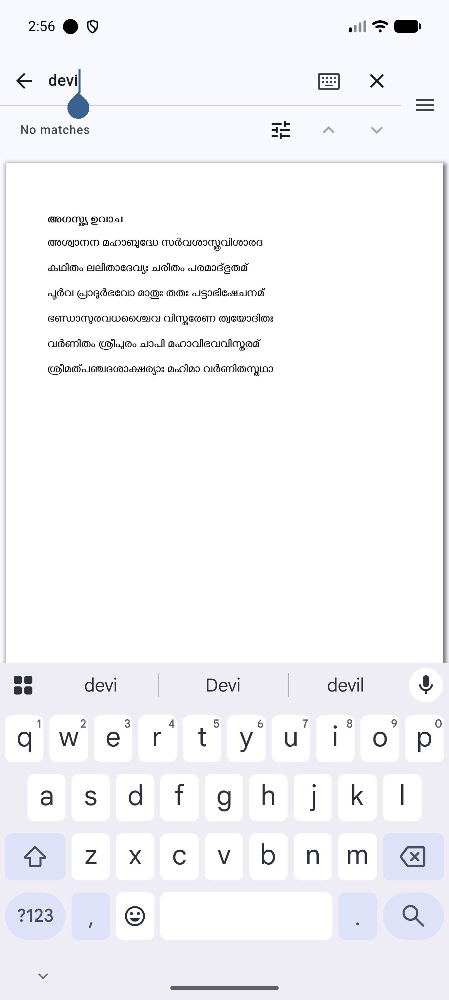
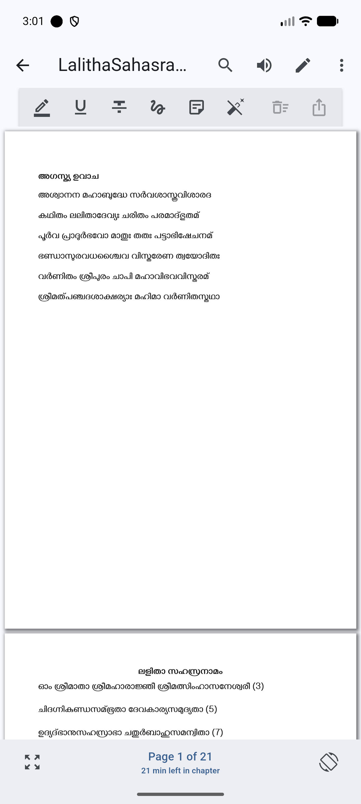
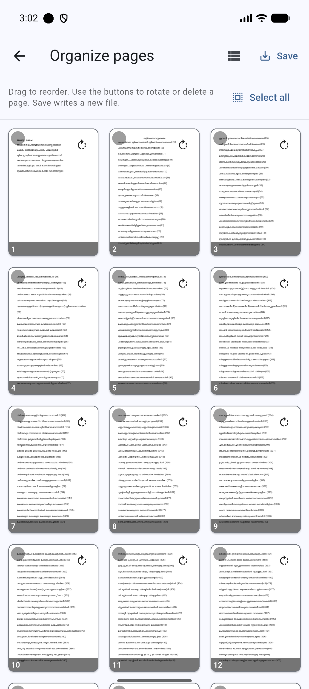
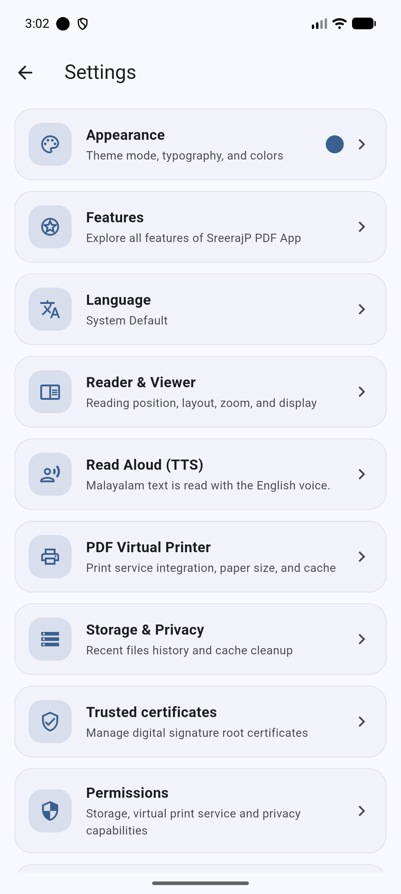

# SreerajP PDF App

[-3DDC84?logo=android&logoColor=white)](https://developer.android.com)
[](https://flutter.dev)
[](https://dart.dev)
[](docs/dependencies.md)
[](docs/security.md)

An **offline-first Android app**, built with Flutter, for **everything PDF**: viewing, reading, phonetic Indic search, Malayalam & English text-to-speech (TTS), annotating, page reorganization, virtual printing, and digital signature verification.

Built exclusively with **open-source libraries** (MIT, BSD, Apache 2.0). Fully offline with **zero network telemetry** (`android.permission.INTERNET` is completely absent from the production manifest).

---

## Screenshots

| Home & Recents | PDF Reader | Indic Sandhi Search |
| :---: | :---: | :---: |
|  |  |  |
| **Home & Recents**<br>Recent files with page count & quick access | **PDF Reader**<br>Crisp rendering, reading metrics & time left | **Indic Sandhi Search**<br>Phonetic search for Malayalam & Sanskrit |

| Annotations & Ink | Page Operations | Settings Hub |
| :---: | :---: | :---: |
|  |  |  |
| **Annotations & Tools**<br>Highlights, strikethrough, ink & notes | **Organize Pages**<br>Reorder, rotate, delete (copy-on-write) | **Settings & Privacy**<br>Appearance, TTS, certificates, permissions |

---

## Key Features

### 📖 High-Performance PDF Viewing
- **Smooth Page Rendering**: Continuous vertical scroll or single-page view with pinch-to-zoom.
- **Reading Metrics**: Real-time reading progress, current page indicator, and chapter time remaining.
- **Night & Comfort Modes**: Inverted dark mode and custom color palettes for comfortable reading in low light.
- **Orientation & Fit**: Fit to page width, fit to screen, and lockable screen orientations.

### 🔍 Indic Phonetic & Sandhi Search
- **Native Indic Language Support**: Built for complex Malayalam and Sanskrit scripts.
- **Phonetic & Sandhi Normalization**: Search matches text across compound characters, chillu variants, and Unicode representations offline.
- **In-Document Search Navigation**: Highlight all matches, navigate previous/next matches, and view total match count.

### 🗣️ Multi-Language Read Aloud (TTS)
- **Malayalam & English Text-to-Speech**: Listen to document content with background playback support.
- **Honest State Reporting**: TTS controls report ready, needs-installation, or unavailable status directly to the user. Never displays broken buttons.

### ✏️ Annotations, Ink & Bookmarks
- **Text Markup**: Highlight, strikethrough, and underline text.
- **Freehand Ink**: Draw and sketch notes directly on PDF pages with custom colors and stroke widths.
- **Sticky Notes**: Place notes on specific coordinates on any page.
- **Bookmarks & Outlines**: Table of contents navigation and custom page bookmarks.
- **Export & Clear**: Export annotated copies or clear markup with a tap.

### 📑 Safe Copy-on-Write Page Operations
- **Strict Copy-on-Write**: Original PDF files are **never** modified in place. Every operation generates a brand-new file.
- **Organize Pages**: Visual thumbnail grid to reorder pages with drag-and-drop, rotate pages by 90°/180°/270°, or delete pages.
- **Merge & Split**: Combine multiple documents into one or split a document into separate files.
- **Compress & Watermark**: Reduce file size (best-effort) and add text or image watermarks.
- **Trim Margins & Booklet Layout**: Crop blank margins for mobile screens and generate 2-Up foldable booklet imposition layouts.
- **Security & Encryption**: Protect documents with passwords or remove passwords from protected files.

### 🖨️ Virtual PDF Printer
- **Android Print Framework**: Seamless integration with the native Android Print Service.
- **Print to PDF**: Save web pages or documents to standard PDF with custom paper size selection (A4, Letter, Legal, etc.).

### 🔐 Offline Digital Signature Verification
- **Cryptographic Verification**: Native Kotlin implementation using `PdfBox-Android` and Bouncy Castle.
- **Offline Trust Store**: Verify certificate chains against bundled EU trusted root certificates without internet access.
- **User Certificate Management**: Import and manage custom trusted root certificates.

### 🛡️ Privacy & Scoped Storage
- **Zero Internet Access**: `android.permission.INTERNET` is not included in the production app. No analytics, tracking, or network telemetry.
- **Scoped Storage (SAF)**: Uses Android Storage Access Framework and "Open with" intents. No broad external storage permissions requested.
- **Volatile Passwords**: Passwords for encrypted PDFs exist only in temporary memory and are immediately cleared.

---

## Architecture & Tech Stack

The application follows a **Tier 2 Feature-First** architecture:

- **Framework**: Flutter 3.44.8+ / Dart 3.12.2+
- **State Management**: [Riverpod 2.6+](https://riverpod.dev) (`flutter_riverpod`)
- **Navigation**: [GoRouter](https://pub.dev/packages/go_router)
- **Local Database**: [sqflite](https://pub.dev/packages/sqflite) (SQLite with WAL mode)
- **Native Android**: Kotlin, PdfBox-Android, Bouncy Castle (`CertPathValidator`)
- **Localization**: Native Flutter `gen-l10n` supporting English (`en`), Malayalam (`ml`), and Sanskrit (`sa`).

```
lib/
├── app/                  # Application configuration, router, and themes
├── core/                 # Shared database, storage, constants, and utilities
├── features/             # Feature modules (Tier 2 Feature-First)
│   ├── annotations/      # Highlights, ink drawings, notes, bookmarks
│   ├── home/             # Recent documents and file access
│   ├── page_operations/  # Reorder, rotate, split, merge, compress
│   ├── print/            # Virtual printer service
│   ├── reading/          # Reading progress and metrics
│   ├── search/           # Indic phonetic and Sandhi search
│   ├── settings/         # Themes, TTS, certificates, permissions
│   ├── signatures/       # Digital signature verification
│   ├── tts/              # Text-to-speech audio reader
│   └── viewer/           # Core PDF viewer and rendering
└── l10n/                 # Localization ARB files (en, ml, sa)
```

---

## Prerequisites

- **Flutter SDK**: `3.44.8` or higher (`flutter --version`)
- **Dart SDK**: `3.12.2` or higher
- **JDK**: JDK 17 for Android Gradle builds. Set `JAVA_HOME` or configure via:
  ```bash
  flutter config --jdk-dir <path-to-jdk-17>
  ```
- **Android SDK**: `minSdk 26` (Android 8.0), `targetSdk 35` (Android 15), AGP 8.x.

---

## Build Flavors

This project defines two Gradle product flavors:

| Flavor | Application ID | App Name | Signing Keystore |
|---|---|---|---|
| `dev` | `in.sreerajp.pdfapp.dev` | SreerajP PDF App Dev | Debug keystore (automatic) |
| `prod` | `in.sreerajp.pdfapp` | SreerajP PDF App | Release keystore (`android/key.properties`) |

> ⚠️ Always pass `--flavor dev` or `--flavor prod`. A bare `flutter run` or `flutter build` will fail.

---

## Development Setup

1. **Clone the repository**:
   ```bash
   git clone https://github.com/sreerajp80/SreerajP_PDFApp.git
   cd SreerajP_PDFApp
   ```

2. **Install dependencies**:
   ```bash
   flutter pub get
   ```

3. **Generate localizations**:
   ```bash
   flutter gen-l10n
   ```

4. **Run development build**:
   ```bash
   flutter run --flavor dev
   ```

---

## Testing & Quality Assurance

- **Run all unit and widget tests**:
  ```bash
  flutter test
  ```
  *(Database tests execute on the host machine using `sqflite_common_ffi`.)*

- **Static analysis** (must maintain 0 warnings):
  ```bash
  flutter analyze
  ```

- **Format code**:
  ```bash
  dart format .
  ```

---

## Production Release

### Build Split-ABI Release APKs
```bash
flutter build apk --flavor prod --release \
  --obfuscate --split-debug-info=build/symbols/android-prod/ --split-per-abi
```

### Build Production App Bundle (AAB)
```bash
flutter build appbundle --flavor prod --release \
  --obfuscate --split-debug-info=build/symbols/android-prod/
```

---

## Database Migrations

Database schema versioning and migrations are located in `lib/core/storage/`:
1. Increment `AppConstants.databaseVersion` in `lib/core/constants/app_constants.dart`.
2. Append the migration function to the `migrations` map in `lib/core/storage/migrations.dart`.
3. Add an upgrade-path unit test in `test/core/storage/` verifying `v1 -> current`.
4. Document the migration in [docs/architecture.md](docs/architecture.md).

---

## Documentation

- [docs/architecture.md](docs/architecture.md) — Technical architecture, state management, and data flow.
- [docs/security.md](docs/security.md) — Offline architecture, scoped storage, and crypto verification.
- [docs/features.md](docs/features.md) — Comprehensive feature inventory and status.
- [docs/dependencies.md](docs/dependencies.md) — Approved open-source dependencies and license compliance.
- [docs/release_process.md](docs/release_process.md) — Release checklist and signing instructions.
- [docs/pdf_idea.md](docs/pdf_idea.md) — Product vision and initial concept.

---

## License

This project is licensed under open-source terms. See [LICENSE](LICENSE) for details. All third-party libraries used are strictly open source (MIT, BSD, Apache 2.0).

